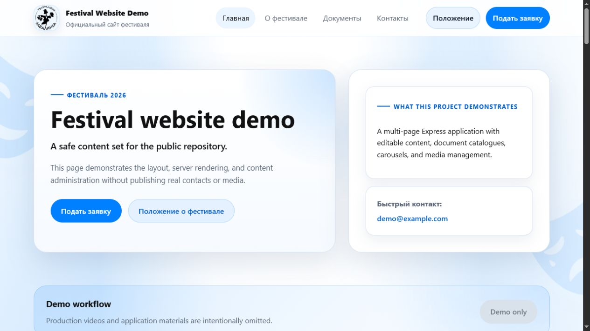
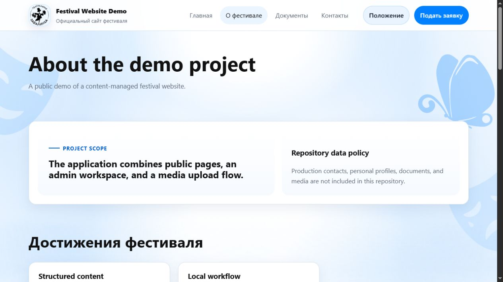
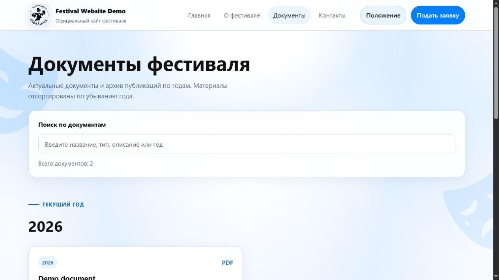
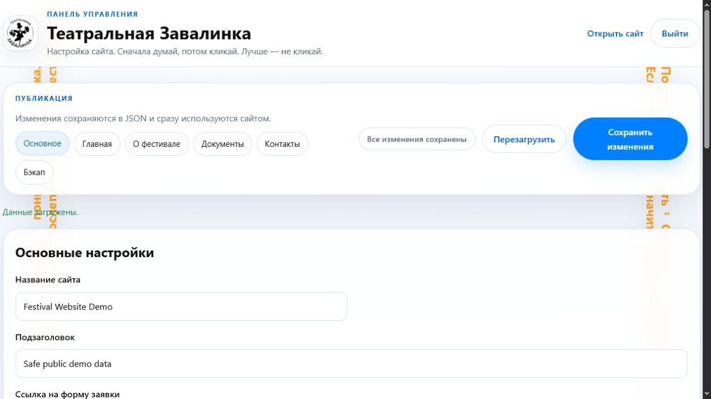

[Русский](README.md) | [**English**](README.en.md)

# Teatralnaya Zavalinka

[](https://github.com/almuleev/teatralnaya-zavalinka-site/actions/workflows/ci.yml)
[](https://nodejs.org/)
[](LICENSE)

A multi-page website for the Teatralnaya Zavalinka festival with server-side rendering and a built-in content administration area.

Live website: [tzavalinka.ru](https://tzavalinka.ru) and [teatrzavalinka.ru](https://teatrzavalinka.ru).

## Screenshots

The screenshots use the fictional demo data set committed to this repository.

| Home page | About page |
| --- | --- |
| [](docs/screenshots/demo-home.png) | [](docs/screenshots/demo-about.png) |

| Documents catalogue | Administration workspace |
| --- | --- |
| [](docs/screenshots/demo-documents.png) | [](docs/screenshots/demo-admin.png) |

## Features

- Public pages: `/home`, `/info`, `/docs`, and `/contacts`.
- Password-protected administration area at `/admin`.
- Structured JSON content with server-side page rendering.
- Upload workflows for images, documents, and video.
- Image optimisation and unused-upload cleanup tools.
- Responsive vanilla JavaScript interface.

## Stack

- Node.js and Express
- Express Session, Express Rate Limit, and Multer
- Vanilla JavaScript and CSS
- PM2 and Nginx for production deployment

## Run Locally

Requirements: Node.js 18+ and npm 9+.

On Windows, run `run-local-server.bat` from the project root. It creates a local `.env` and a runtime copy of the demo content when they are missing. If the configured port is occupied, the launcher selects the next available port and prints the actual URL.

Alternatively:

```bash
npm install
copy .env.example .env
copy data\site-content.example.json data\site-content.json
npm run dev
```

Open `http://localhost:3000/home` or the URL printed by the launcher.

The local administration credentials are listed in `.env.example` and are intended for demo mode only.

## Checks

```bash
npm test
npm audit --omit=dev
```

The tests cover syntax, primary HTTP routes, authentication boundaries, unsafe URL filtering, and occupied-port handling.

## Repository Data

Production content and uploaded files are not published:

- `data/site-content.json` is local-only and ignored by Git.
- `data/site-content.example.json` contains fictional demo data.
- `public/uploads/**` is ignored because it may contain licensed media, documents, and personal data.

After cloning, create `data/site-content.json` from the example file or use `run-local-server.bat`.

## Production Configuration

Production requires a private `.env` file. When `NODE_ENV=production`, the server validates:

- `SESSION_SECRET` with at least 32 characters.
- `ADMIN_USERNAME` with at least 3 characters.
- `ADMIN_PASSWORD` with at least 12 characters.

Production content and media must be stored outside the repository. See [DEPLOY.md](DEPLOY.md) for deployment instructions.

## Project Structure

```text
data/
  site-content.example.json  # demo data tracked by Git
  site-content.json          # local or production data, ignored by Git
public/
  assets/
  uploads/                   # local or production media, ignored by Git
server/
deploy/
```

## License

[MIT](LICENSE)
